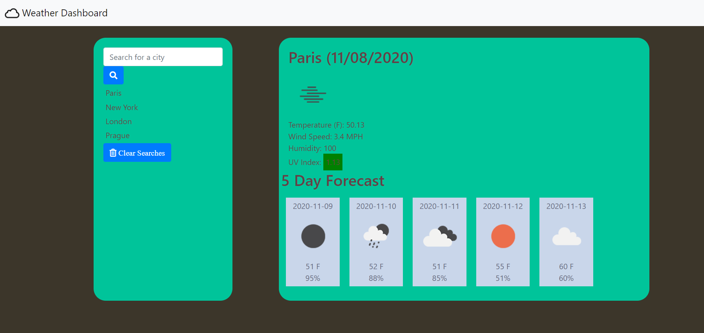

# Weather-Dashboard
This application provides the user with weather data based on their search for a city. When the user returns to the page they will be shown the weather data from their most recent search, which makes viewing weather data for your favorite location or current location easily. 

## Motivation
I created this application so that users could easily view weather data for cities across the globe. The basic user interface provides a distraction free way for the user to check the current weather as well as a five day forecast. 

 
## Screenshots

## Tech/framework used
Bootstrap
Jquery
Moment.js

## Installation
To install this application simply clone the repository. 

## Credits 
Cloud icon in nav bar by Dmitry Baranovskiy from the Noun Project

## API Used
This application uses a variety of APIs from Openweathermap.org
